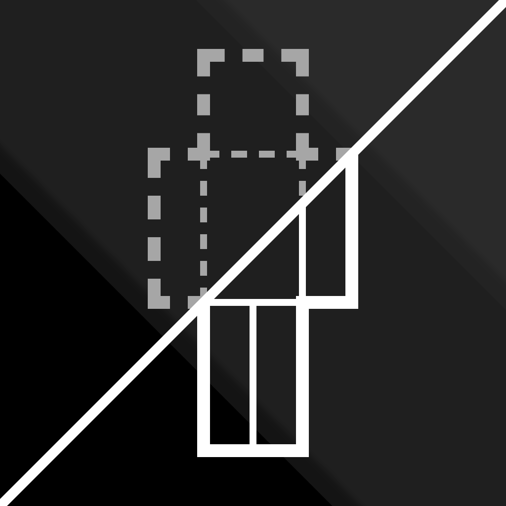
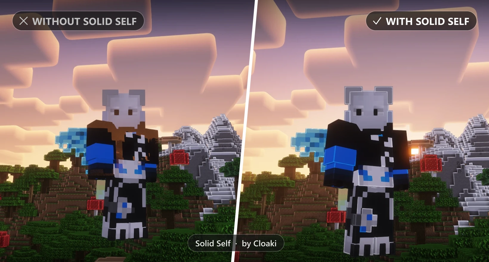

# Solid Self

**Solid Self fixes players rendering see-through and being ignored by shader effects when using [Iris](https://modrinth.com/mod/iris) shaders.**
*(and does nothing more!)*

## The bug

Since Minecraft 26.x, players rendered with Iris shaders can behave strangely:

- **Players turn semi-transparent** from certain camera angles, most noticeable in third person when looking towards the sky or a bright light source
- **Shader effects skip players entirely**, for example world outlines, which outline every block, mob and cosmetic, but not the player
- **It doesn't matter which shader**: the issue has been reported across different shader packs

See [Iris issue #3105](https://github.com/IrisShaders/Iris/issues/3105).

## The fix

Vanilla Minecraft renders players with the **translucent** entity render type. With Iris, translucent entities are drawn *after* the shader's deferred passes, so every effect that reads the depth buffer there (such as world outlines) can't see the player.

Solid Self switches players to the **cutout** render type, which most mobs already use. The whole fix is a single mixin into `LivingEntityRenderer#getRenderType`, see [`LivingEntityRendererMixin.java`](src/main/java/dev/cloakiy/solidself/mixin/LivingEntityRendererMixin.java).

Not touched: invisibility and spectator rendering, the first-person hand, all other entities.

**Known limitation:** semi-transparent pixels in skins are rendered either fully visible or fully invisible.

## Toggle in-game

Bind **Toggle Solid Self** under *Options → Controls → Key Binds → Solid Self*. The key is unbound by default. The on/off state is saved in `config/solidself.properties`.

## Installation

1. Install [Fabric Loader](https://fabricmc.net/use/)
2. Put [Fabric API](https://modrinth.com/mod/fabric-api) and Solid Self into your `mods` folder
3. Start the game

Downloads are available on **[Modrinth](https://modrinth.com/mod/solid-self)**.

## Support

Found a bug or an incompatible mod? Open an [issue](https://github.com/Cloakyi/solid-self/issues), write to [support@cloaki.de](mailto:support@cloaki.de) or join the [Discord server](https://discord.gg/suwEMTC9b7).

## License

[MIT](LICENSE) © Cloakiy

*Legal (German): [Impressum](https://cloaki.de/impressum/) · [Datenschutzerklärung](https://cloaki.de/datenschutz/) · [Haftungsausschluss](https://cloaki.de/haftung/)*

*NOT AN OFFICIAL MINECRAFT PRODUCT. NOT APPROVED BY OR ASSOCIATED WITH MOJANG OR MICROSOFT.*
